---
layout: post
title: Machine Learning note: The first part
tag: machine_learning

# Machine learning学习笔记（一） 基础知识#
----------

矩阵运算： 
1.维度相同的矩阵才可以相加 
2.行x列 
3.矩阵不存在交换律，存在结合律 
4.只有维度是m*m的矩阵才存在逆矩阵，矩阵与其逆矩阵相乘等于单位矩阵；零矩阵没有逆矩阵。 
  不存在逆矩阵的矩阵叫做奇异矩阵或退化矩阵 

**1.定义** 
Arthur Samuel(1959)未直接编程而赋予计算机学习的能力。 
Tom Mitchell(1998)定义机器学习，计算机程序从经验E中学习解决某一任务T进行某一性能度量P，通过P测定在T上的表现因经验E而提高。 
                  A computer program is said to learn from experience E with respect to some task T and some performance measure P, if its performance on T, as measured by P, improves with experience E.
                  例如计算机判断邮箱中邮件是否为垃圾邮件的过程中，T为进行分类，E为人工分类结果，P为正确分类的邮件数量。 
**2.分类** 
**监督学习 superivised learning** 
    对于数据集中的每个数据，都有相应的正确答案，训练集算法就是基于此整理二者关系，以此来做出预测。 
	监督分类问题可以分为以下两类： 
	1）回归问题“regression”即为通过回归来预测一个连续值得输出(map input variables to some continuous function) 
	2）分类问题“classification”即为预测离散值得输出(map input variables into discrete categories) 
**非监督学习 unsupervised learning** 
    是一种学习机制，仅提供大量的数据，要求算法自动找出数据中蕴含的类型结构。 

### **3.线性回归算法 Learning regression**  ###
常用notation： 
    n=特征量的数目 
    m=训练样本的数目 
	x=输入的变量/特征 
	y=输出的变量/特征 
	(x,y)一个训练样本 
	(x^(i),y^(i))第i个训练样本（从1开始计数哦），x^(i)为第i个训练样本，若有下脚标j，则代表第i个训练样本的第j个特征量 
	h(hypothesis)是一个从x到y的函数映射，  
**单变量线性回归** h_θ(x)=θ_0+θ_1*x 
**平方误差函数**square error function（代价函数 cost function）: 
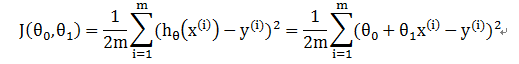  

----------

**线性回归学习算法之一：梯度下降算法** gradient descent:用于最小化函数J(θ)，起始点位置略有不同会导致得到一个非常不同的局部最优解，接近或在全局最优解附近。(多次迭代) 
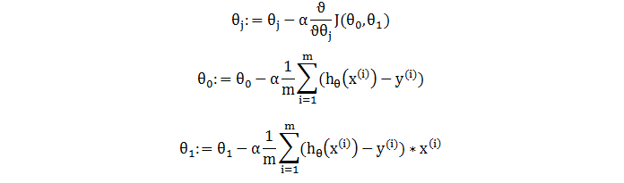 
	α为学习速率,控制以多大的幅度更新参数θ。 θ_0与θ_1应该同时更新（计算） 
Batch gradient descent:批量梯度下降，在梯度下降的每一步，都使用所有训练数据。无局部最优解，只有一个全局最优解。  

----------

**多元线性回归**
h_θ(x)=θ^T*x （均为n+1维） 
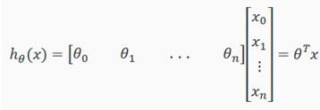 
梯度下降算法：
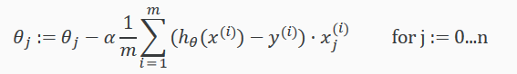  
**特征缩放**（Feature Scaling）：将特征值大小到相似的尺度内，通常在-1到+1范围内。不需要完全在相同的范围或区间内，只要足够接近就可以正常工作。可提高梯度下降法的收敛速度。 
均值归一化（Mean Normalization）：让特征值具有为0的平均值，用xi-μi来替换。 
用(x1 - μ1)/S1替换x1，μ1在训练集中特征x1的平均值，S1为标准差（用最大值减去最小值）。其目的是将梯度下降的速度变得更快，收敛所需循环次数更少 

学习速率的选择：
若α太小，收敛慢；太大，可能不收敛或J会越来越大
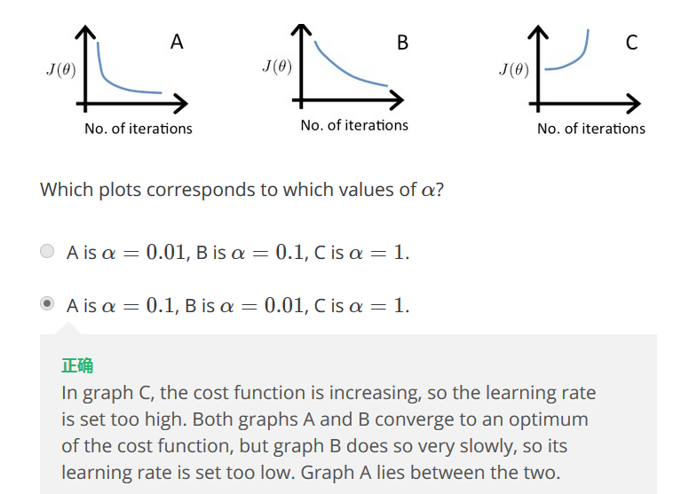 

----------

**线性回归学习算法之二：正规方程（Normal Equation）：**
通过显式地取关于θj的导数，并将其设为零，从而使j最小化。这使得我们不需要迭代就能找到最佳的θ。正态方程公式： 
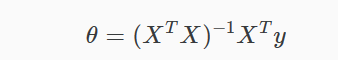 
无需特征缩放。通常n小于一万时，会用正规方程，若大于一万，可能会用梯度下降算法或其他方法。
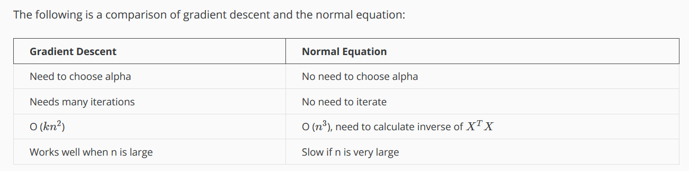 
>pinv() 伪逆 inv()逆 

当出现奇异矩阵，不可求逆时，可能有两个原因： 
①某几个特征量x之间存在线性相关关系，可以只保留一个； 
②m小于或等于n，通过小数据样本得到多个参数，需要通过正则化（regularization）的线性代数方法，删除某些特征。 

----------
### **4.逻辑回归算法（Sigmoid/Logistic Regression）**  ###
针对二进制分类问题，二次项的个数约为n^2/2，三次项的个数以n^3量级增加，  
h_θ(x)代表：输入的x使y=1的概率 
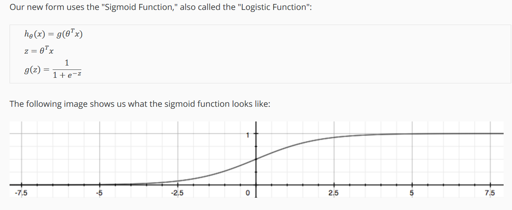 
决策边界（decision boundary）
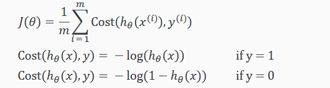 
代价函数：
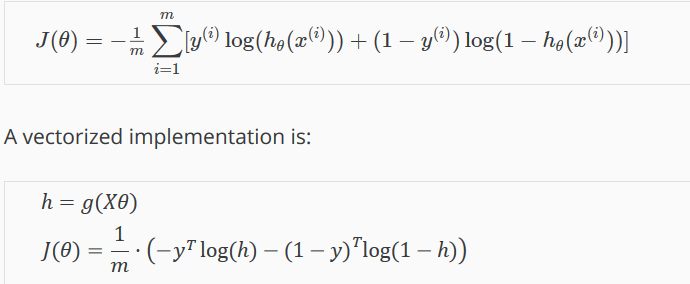 

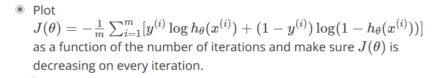 
梯度下降：
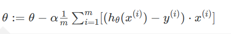 
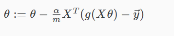 
**常见优化代价函数算法**： 
①BFGS（变尺度法） 
②L-BEGS（限制变尺度法） 
③Conjugate gradient（共轭梯度法） 
④Gradient descent（梯度下降法） 
前三种不需要手动选择学习率α，他们有名为线性搜索（Line Search）的内部循环方法，自动尝试并选择不同的α，所以往往最终收敛地远远快于梯度下降算法，但是更复杂 
>function [jVal, gradient] = costFunction(theta) 
>  jVal = [...code to compute J(theta)...]; 
>  gradient = [...code to compute derivative of J(theta)...]; 
>end 

>options = optimset('GradObj', 'on', 'MaxIter', 100); 
>initialTheta = zeros(2,1); 
>   [optTheta, functionVal, exitFlag] = fminunc(@costFunction, initialTheta, options); 

**一对多问题：**当y不止是有两个值后，如可能为1，2，3，那么将有三个分类器分别预测y为其中一个值得可能性h_θ(x)，当输入x后，便选择最大的h_θ(x)所对应的y为预测值。 

----------
**过度拟合** 
变量过多时，假设函数对训练样本拟合得很好，代价函数很接近0，但对新的样本的预测效果很差。  
解决方法： 
①减少变量数量。人工选择变量集；模型算法选择。 
②**正则化**（Regulariztion）。保留所有变量，减少θ的量级/大小；当有大量特征时，每个变量都为预测Y的值做出了一点贡献。   

正则化： 
线性回归算法的代价函数为： 
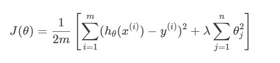 
若正则化参数λ十分过分的大，那么将欠拟合。  
正则化后，梯度下降及正规方程分别为： 
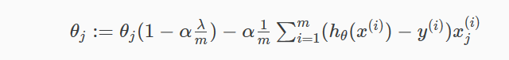  
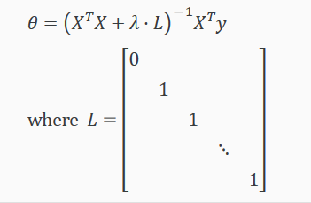 
**L为（n+1）*（n+1）阶矩阵  
逻辑回归算法的代价函数为： 
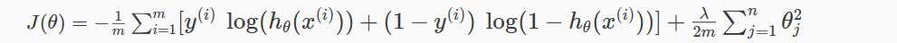 

----------
### **5.神经网络算法（Neural Network）**  ###
随着特征个数的增加，逻辑回归算法的二次项个数过多，最后结果可能过拟合；且运算量过大.故神经网络算法用以解决复杂的非线性分类问题 
通常隐藏层越多越好 
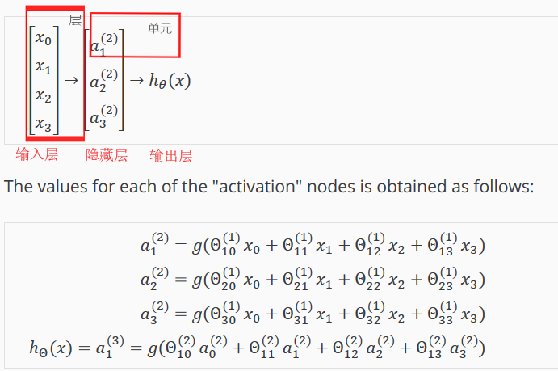 
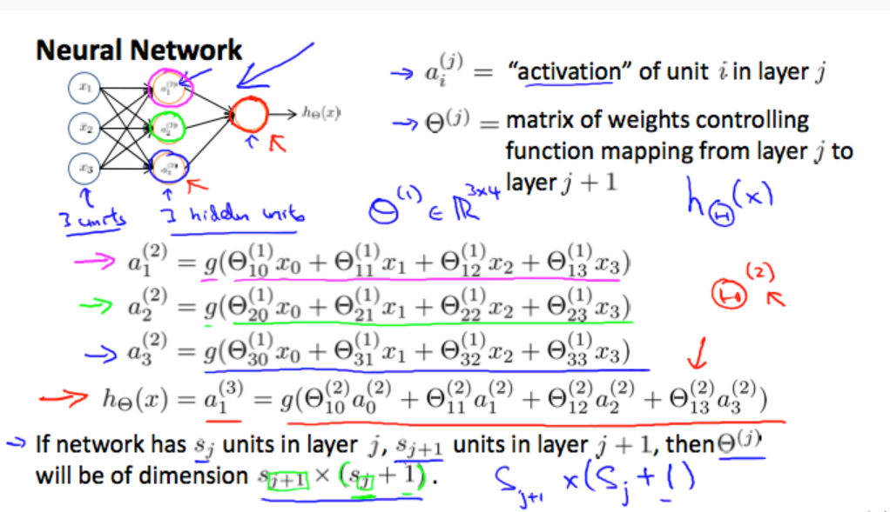 
从输入层到隐藏层再到输出层依次计算其激励函数的过程叫前向传播（forward propagation）  
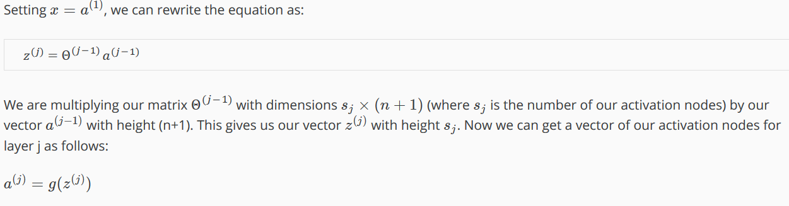  
与或非的参数矩阵： 
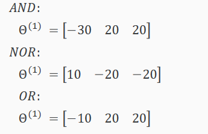   
**代价函数** 
对于神经网络，其代价函数是非凸函数，理论上可以收敛于局部最小值。 
L层数； 
s_l在第l层的单元数（不包括偏置单元bias unit）； 
K输出单元数量； 
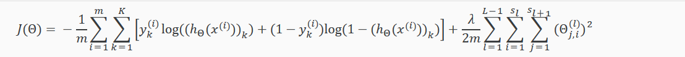 
当前theta矩阵中的列数等于当前层中的节点数（包括偏移单位）。 当前theta矩阵中的行数等于下一层中的节点数（不包括偏移单位）。  

**后向传播定律** 
用以计算代价函数最小值，算出梯度下降的方向 
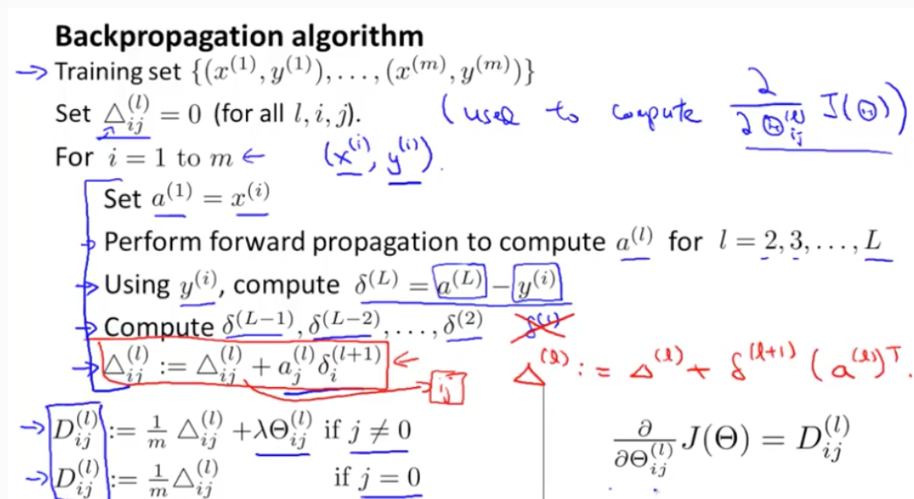   
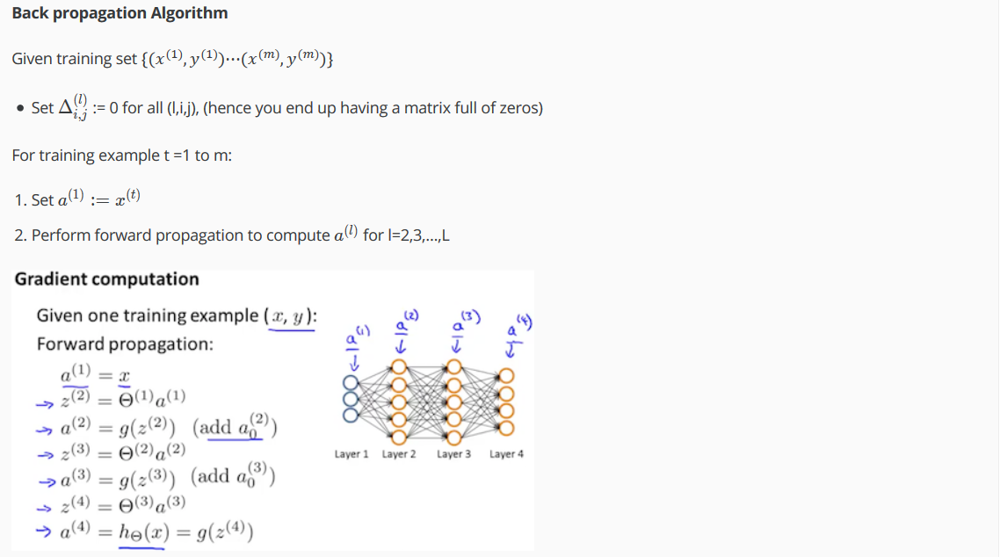 
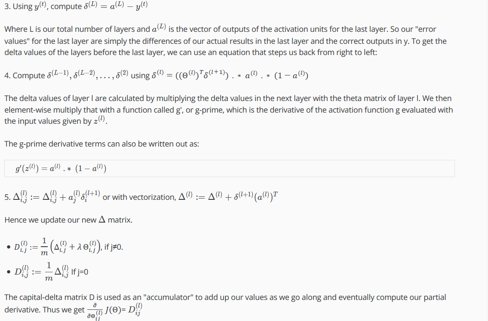 
将系数以矩阵形式存储时，计算前向传播和反向传播会更方便使用，将其展开unroll成向量形式时，使用高级优化算法时更方便。  

**梯度检验gradient checking** 
后向传播有很多细节，导致theta函数的J每次迭代都在下降，但可能代码仍有很多bug，实际结果又很大误差。故用梯度检验减少这种错误的概率 
使用numerical gradient，此算法计算极其缓慢
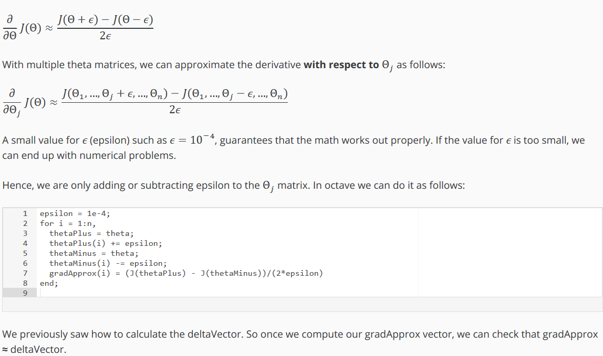 

**随机初始化Random Initialization** 
逻辑回归可采用全部为0为初始值。而若是NN采用0作为初始值，那么所有隐层的结果都相等，这叫做对称现象。故初始化的目的是为了打破对称。 
>Theta1 = rand(10,11) * (2 * INIT_EPSILON) - INIT_EPSILON;   

（将正则化方法加入模型并不是每次都能取得好的效果,如果λ取得太大的化就会导致欠拟合. 这样不论对traing set 还是 examples都不好） 