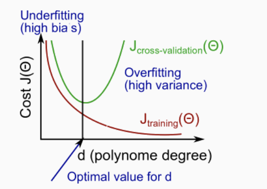
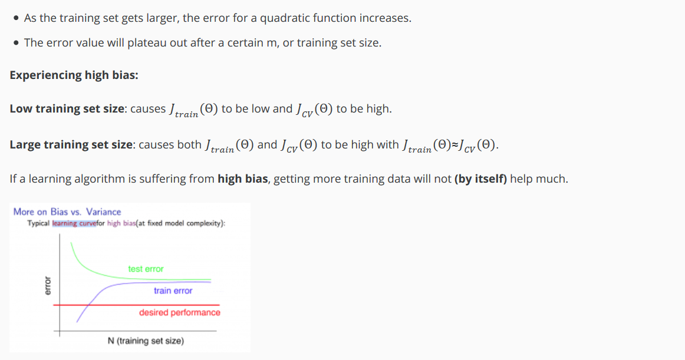
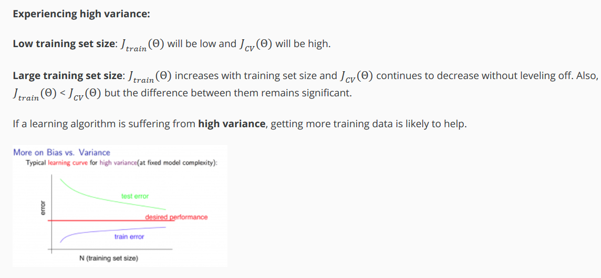
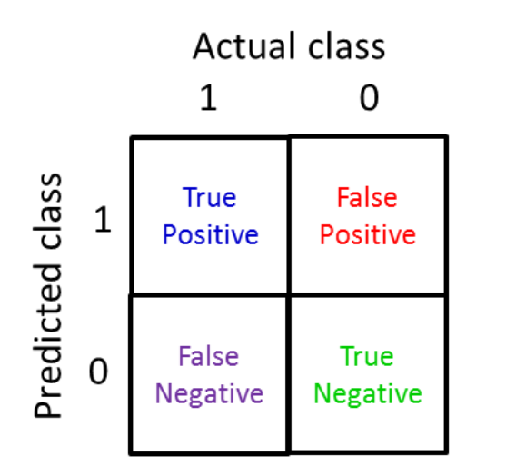
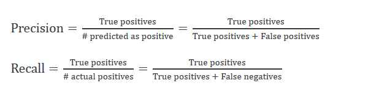
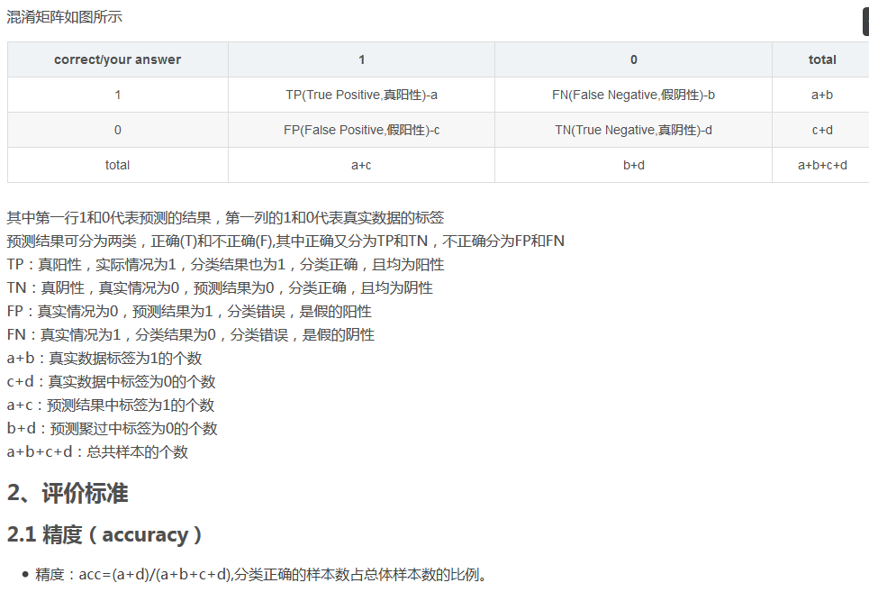

---
layout: post 
title: Machine Learning note: The second part 
tag: machine_learning 

# Machine learning学习笔记（二） 诊断法#
----------

提升算法性能的几种方法： 
1. 增加训练样本数量——高方差 
2. 减少特征集数量——高方差 
3. 添加特征——高偏差 
4. 添加特征多项式（相当于增加特征）——高偏差 
5. 减小λ——高偏差 
6. 增大λ——高方差  
为评估训练集误差大小，将数据集分为训练集和测试集，一般比例为7：3。 
为，将数据集分为训练集(training set)、交叉验证集（Cross Validation set）、测试集（test set），典型的分割比例为6：2：2。 
交叉验证集的最终目的是用来求取最好多项式次数d。 
测试集用以估计所选模型的泛化误差。  

算法不理想的两种情况： 
1. 偏差较大=欠拟合=交叉验证误差和训练误差都很大 
2. 方差较大=过拟合=交叉验证误差很大，训练误差很小，前者远远大于后者 
 

**学习曲线Learning Curves** 
来判断某一个学习算法是否处于偏差、方差问题，或是二者皆有 
 
 
当方差较大时，增加训练样本数量会有所改善此情况。 

神经网络算法，较少的隐藏单元易导致欠拟合，但参数少、计算量小；较大型的神经网络结果，易过拟合（可通过正则化改善），计算量大，但网络性能通常较小型的更好。 
使用单个隐藏层是一个很好的开始默认设置，可以使用交叉验证集在多个隐藏层上训练神经网络，选择性能最好的一个。  
最初以简单算法开始训练，在交叉验证集进行测试，画出学习曲线以分析算法处于何种问题，手动检查交叉验证集中的示例中的错误，并尝试找出导致大多数错误的趋势。  

**偏斜类skewed classes**： 
正样本的数量与负样本的数量相比非常非常少 
可用查准率（precision）和召回率（recall）来评估此种情况下的误差大小。 
 
如果一个分类模型拥有高查准率和召回率，那么可以确信地说，这个算法表现很好。 
 
 
在交叉验证集中，计算F 
 
 
Increasing the threshold means more y = 0 predictions. This will increase the decrease of true positives and increase the number of false negatives, so recall will decrease. 
增加阈值，将增大P，减小R 
